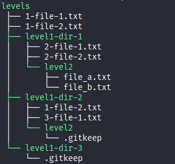

# Kigi -> Tree directory
You can generate a json
```
{ 
	path: '/path/tree-directory/test/levels',
  name: 'levels',
  size: 139,
  isSymbolicLink: false,
  createAt: 2018-08-30T01: 18: 57.086Z,
  updateAt: 2018-08-30T01: 18: 57.086Z,
  children: [
		{  path: '/path/tree-directory/test/levels/2-file-1-link.txt',
       name: '2-file-1-link.txt',
       size: 76,
       isSymbolicLink: true,
       createAt: 2018-08-30T01: 18: 57.086Z,
       updateAt: 2018-08-30T01: 18: 57.086Z,
       realPath: '/path/tree-directory/test/levels/level1-dir-1/2-file-1.txt'
		},
		{  path: '/path/tree-directory/test/levels/level1-dir-1',
       name: 'level1-dir-1',
       size: 0,
       isSymbolicLink: false,
       createAt: 2018-08-27T23: 09: 37.505Z,
       updateAt: 2018-08-27T23: 09: 37.505Z,
       children: [Array
			],
       type: 'directory'
		},
		{  path: '/path/tree-directory/test/levels/level1-dir-1-link',
       name: 'level1-dir-1-link',
       size: 63,
       isSymbolicLink: true,
       createAt: 2018-08-30T01: 08: 29.102Z,
       updateAt: 2018-08-30T01: 08: 29.102Z,
       realPath: '/path/tree-directory/test/levels/level1-dir-1'
		},
		{ path: '/path/tree-directory/test/levels/level1-dir-2',
       name: 'level1-dir-2',
       size: 0,
       isSymbolicLink: false,
       createAt: 2018-08-27T23: 10: 43.674Z,
       updateAt: 2018-08-27T23: 10: 43.674Z,
       children: [
				{ 
					path: '/path/tree-directory/test/levels/level1-dir-3',
					name: 'level1-dir-3',
					size: 0,
					isSymbolicLink: false,
					createAt: 2018-08-27T23: 10: 43.674Z,
					updateAt: 2018-08-27T23: 10: 43.674Z,
					children: [],
					type: 'directory'
				}
			],
			type: 'directory'
		}
	],
  type: 'directory'
}
  ```
Or you can generate a tree string



Try node test/test.js
